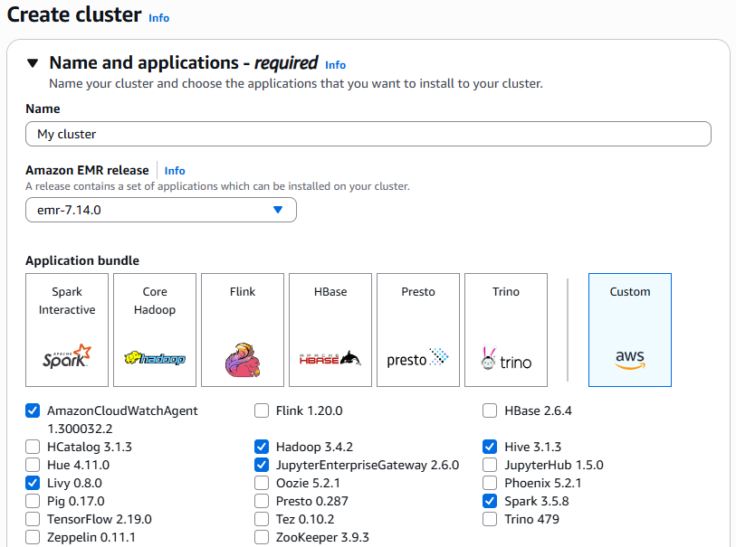
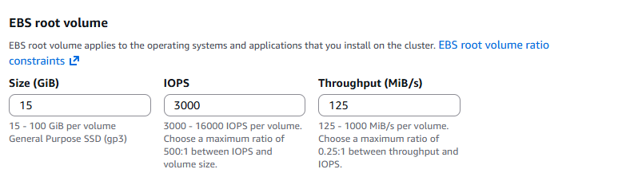
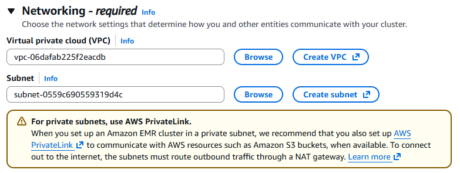
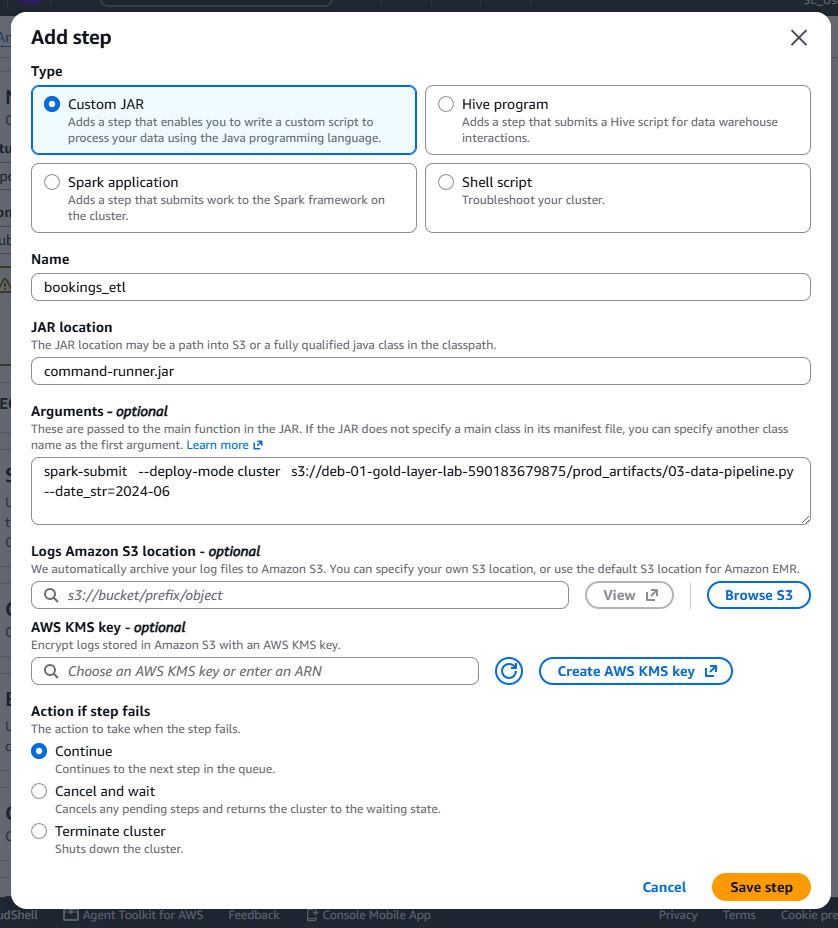
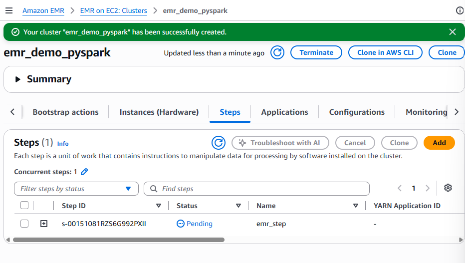

# Running a PySpark Data Pipeline on AWS EMR

## Overview

This lab walks through the complete process of running a PySpark data pipeline on **AWS EMR**, using data stored in **Amazon S3**.

The pipeline performs the following high-level operations:

1. Upload source datasets to S3.
2. Organize the datasets using year/month partitions.
3. Upload the PySpark data pipeline code to S3.
4. Create an AWS EMR cluster with Spark and Hadoop.
5. Configure an EMR step to run the PySpark pipeline.
6. Provide the processing month as a parameter.
7. Allow the EMR cluster to read from and write to S3.
8. Run the ETL pipeline.
9. Verify the transformed data in the Gold layer.

> **Source:** This guide is based on the provided lab transcript. It preserves the workflow and terminology used in the session.

---

## Architecture

```
Local Dataset
     |
     v
Amazon S3
(Silver / Raw Data)
     |
     v
AWS EMR Cluster
     |
     |-- Spark Submit
     |-- PySpark ETL
     |-- Data Transformations
     |-- Data Quality Checks
     |
     v
Amazon S3
(Gold Layer)
     |
     +--> Fact Bookings
```

---

# 1. Prerequisites

Before starting the lab, make sure you have:

- An AWS account.
- Access to the AWS Management Console.
- The taxi trips dataset supplied for the lab.
- The exchange-rates Parquet file supplied for the lab.
- The `data pipeline` Python file supplied as part of the lab artifacts.

This guide uses **June** as the example processing month.

---

# 2. Upload the Taxi Trips Dataset to S3

The first step is to upload the taxi trips dataset into the Silver-layer S3 location.

The dataset used in the demonstration is the **for-hire vehicle taxi trips dataset for June**.

Create the required partition path and upload the file there.

The pipeline receives the processing period as a year/month parameter, so the S3 structure needs to match the expected partitioning.

Example structure:

```
deb-01-silver-layer-lab-590183679875/
└── transport 
        └── bookings/
            └── year=2024/
                └── month=06/
                    └── green_tripdata_2024-06.parquet
```

> Use the exact bucket and folder structure supplied by your lab environment.

---

# 3. Upload the Exchange Rates Dataset

Create an `exchange rates monthly` folder/path in the Silver layer.

The exchange-rates Parquet file provided with the lab should be uploaded into the appropriate year/month partition.

Example:

```
deb-01-silver-layer-lab-590183679875/
└── exchange-rates-monthly/
    └── year=2024/
        └── month=06/
            └── exchange_rates_2024_06.parquet
```

For the June demonstration, upload the exchange-rates Parquet file into the corresponding June partition.

The exchange-rates file must be uploaded into the expected partition path so that the pipeline can read it.

---

# 4. Prepare the Gold-Layer Destination

The pipeline writes the transformed data into the Gold layer.

The main destination is:

```
deb-01-gold-layer-lab-590183679875/
└── datawarehouse/
```

Within this area, the transformation process first writes data into a staging location.

Example:

```
deb-01-gold-layer-lab-590183679875/
└── datawarehouse/
    └── staging_fact_bookings/
```

The transformed fact data is partitioned by:

```
year
month
day
```

Therefore, after processing June, the output is expected to contain partitions representing the days of June.

Example:

```
staging_fact_bookings/
├── year=2026/
│   └── month=06/
│       ├── day=01/
│       ├── day=02/
│       ├── day=03/
│       └── ...
```

The transform step initially writes to the staging facts area and partitions the output by year, month, and day.

---

# 5. Upload the PySpark Pipeline Code to S3

Create or use the `prod_artifacts` folder in the Gold layer.

This folder acts as the code-base/artifacts directory.

Upload the provided Python data pipeline file here.

Example:

```
deb-01-gold-layer-lab-590183679875/
└── prod_artifacts/
    └── 03_data_pipeline.py
```

The exact filename should be the one provided with the lab artifacts.

The S3 path of this Python file will later be passed to the EMR Spark job.

---

# 6. Open the AWS EMR Console

Now create an EMR cluster to execute the PySpark pipeline.

### Steps

1. Open the **AWS Management Console**.
2. Search for **EMR**.
3. Open the **Amazon EMR** console.
4. Create a new cluster **Create cluster**.

AWS EMR is the managed Spark environment used in this lab.

EMR is AWS's managed service for running Spark workloads.

---

# 7. Configure the EMR Cluster

**Step1:** Cluster Name

Give the cluster a meaningful name.

Example:

```
emr_demo_pyspark
```

**Step2:** EMR Release

Select the EMR release required by the lab.

The demonstration uses:

```
emr-7.14.0
```

Different EMR versions provide different versions of Spark, Trino, and related components.

---

**Step3:** Select Applications

For this exercise, select the applications/components required for the Spark workload.

The demonstration primarily uses:

```
Spark
Hadoop
```

Keep other options at their defaults unless your lab requires something different. 



---

# 8. Configure EC2 Instance Types

For the demonstration, the following configuration is used:

| Node | Instance Type | Number |
|---|---|---:|
| Primary | `r8g.xlarge` | 1 |
| Core | `r8g.xlarge` | 1 |
| Task | `r8g.xlarge` | 1 |

The dataset used in the lab is small, so a single machine is used for each node type.

The machine cost is approximately **$0.24/hour**, and the pipeline completes in roughly five minutes in the demonstration environment. Actual cost and execution time can vary.

---

# 9. Configure Storage

The demonstration also attaches local storage to the cluster.

The purpose is to provide additional disk space if Spark needs to spill intermediate data during processing.

For this lab, keep the configuration aligned with the demonstrated/default setup unless your environment requires different storage.



---

# 10. Configure Networking

The demonstration uses the default VPC created with the AWS account.

Use the appropriate VPC and networking configuration available in your lab environment.



> Note: If default VPCs are not available, you may need to create a new VPC and subnets for the EMR cluster. This is outside the scope of this lab.

---

# 11. Configure the EMR Step

Once the EMR cluster is created, the PySpark application needs to be submitted as an EMR **Step**.

Click on **Add step** to configure the Spark job.

Use:

```
Step Type: Custom JAR
```

Give the step a name such as:

```
bookings_etl
```

For the JAR location, use:

```
command-runner.jar
```

The command uses Spark Submit.

The EMR step executes the pipeline using `spark-submit`.

Conceptually, the command is:

```
spark-submit   --deploy-mode cluster   s3://deb-01-gold-layer-lab-590183679875/prod_artifacts/03-data-pipeline.py   --date_str=2024-06
```

The exact S3 path and filename should match your lab environment.

This demonstrates passing the Python pipeline path from the Gold-layer `prod artifacts` directory.



---

# 15. Configure IAM Permissions

This is one of the most important steps.

The EMR EC2 machines need access to S3 because the pipeline:

```text
Reads data from S3
        ↓
Transforms data
        ↓
Writes data back to S3
```

Therefore, the EMR instances require appropriate S3 permissions.

---

# 16. Configure the EMR IAM Role and EC2 Instance Profile

Create a new IAM role for the EMR cluster.

- Select creating a new role on both the EMR role and the EC2 instance profile.
- This role allows the EMR cluster to read from and write to S3.

---

# 18. Create the EMR Cluster

Click:

```
Create cluster
```

EMR cluster creation takes several minutes.

EMR cluster creation takes approximately **7–8 minutes** to become ready in the demonstration environment.



---

# 19. Monitor the EMR Step

Once the cluster is ready

- click on the **Steps** tab.
- The ETL step should be in the **Pending** state.
- After a few minutes, the step will transition to **Running**.
- The step will eventually complete successfully.

The pipeline performs the following logical flow:

```
Read source data
      ↓
Transform data
      ↓
Run data quality checks
      ↓
Write transformed data to staging
      ↓
Read staging data for validation
      ↓
Commit/finalize the data
      ↓
Gold S3 data
```

The pipeline reads data from S3, performs transformations and data-quality checks, and finally moves/commits the data into the final S3 location.

---

# 21. Verify the Staging Data

After the Spark job starts, open the Gold-layer S3 location.

Navigate to the transport bookings staging area.

You should see output similar to:

```
deb-01-gold-layer-lab-590183679875
    └── datawarehouse/
        └── staging_fact_bookings/
            └── year=2024/
                └── month=06/
                    └── day=...
                        └── *.parquet
```

This verifies that the transform step writes Parquet data into the staging path.

---